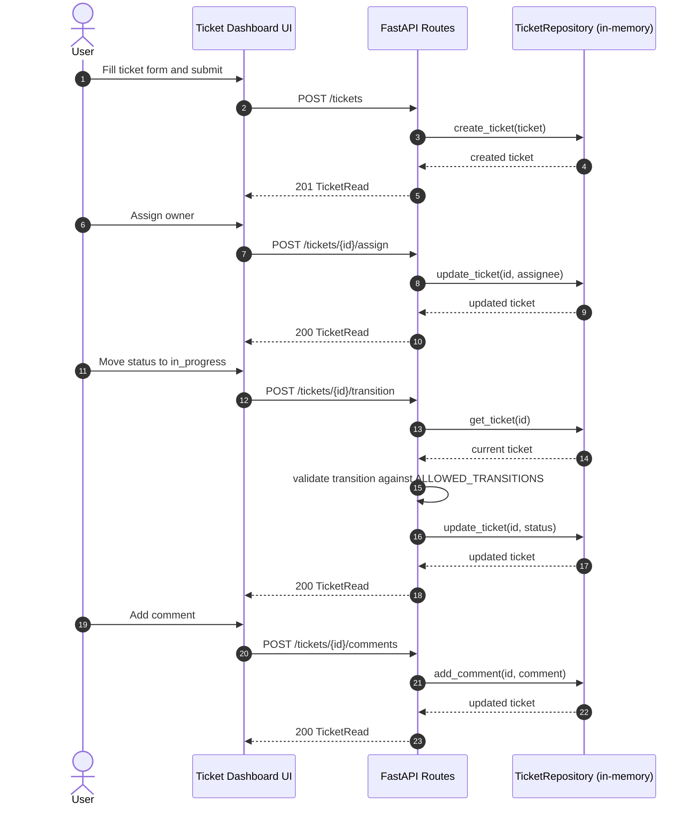

# Ticket API Sequence Diagram

This diagram describes a typical ticket lifecycle through the current API.

## Alternate path: invalid transition

If a transition is not allowed by the workflow matrix, the API responds with:

- `400 Bad Request`
- Message: `Invalid transition from <current> to <target>`
